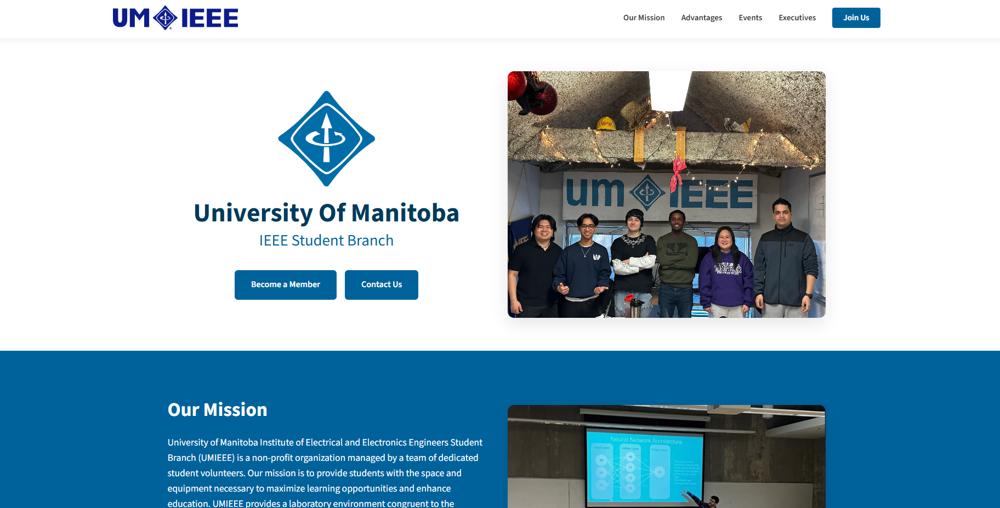

# UMIEEE Official Website




Welcome to the University of Manitoba IEEE Student Branch website. 

The site is built with [Astro](https://astro.build/), a modern web framework for building fast and content-focused websites. The project uses Astro components and content collections to keep recurring content organized and easy to update.

Check out the website at [umieee.ca](https://www.umieee.ca/)!


# Editing

Start by installing [Node.js](https://nodejs.org/) and `npm`.

Install the packages required by the project:

```bash
npm install
```

Run the site locally to verify your changes:

```bash
npm run dev
```

Astro will provide a local development URL in the terminal.


## Modifying Executive Members

Navigate to:

```text
./src/content/executives/
```

Add or edit a Markdown file such as `my_exec_name.md`:

```yaml
---
order: 7
name: Joe Beans
role: Fun Officer
image: ./joe_beans.webp
href: https://www.linkedin.com/in/joe_beansss/
---
```

* `order` determines where the executive appears on the page.
* `name` is the executive's name.
* `role` is their position.
* `image` references an image in the same directory as the Markdown file.
* *`href` is optional. Clicking the executive card opens the link in a new tab.

Add the executive's image to the same directory:

```text
./src/content/executives/joe_beans.webp
```

Astro's image handling supports common image formats such as PNG, JPEG, WebP, and other supported image formats.

## Modifying Event Highlights

Navigate to:

```text
./src/content/events/
```

Add or edit a Markdown file such as `your_custom_event.md`:

```yaml
---
order: 3
title: Connor's Fun Hangout
date: October 16, 2025
description: Hosted on the quad
image: ./connors_poster.jpg
href: https://connors-fun-hangout-website.com/
---
```

* `order` determines where the event appears in the event scroller (1 is oldest).
* `title` is the event name.
* `date` is the displayed event date.
* *`description` is optional.
* `image` references an image in the same directory as the Markdown file.
* *`href` is optional. Clicking the event card opens the link in a new tab.

Add the event image to the same directory:

```text
./src/content/events/connors_poster.jpg
```

## Modifying Sponsors

Navigate to:

```text
./src/content/sponsors/
```

Add or edit a Markdown file such as `digikey.md`:

```yaml
---
order: 5
name: DigiKey
image: ./digikey.webp
href: https://www.digikey.ca/
---
```

* `order` determines the sponsor's position in the sponsor marquee.
* `name` is the sponsor's name.
* `image` references an image in the same directory as the Markdown file.
* *`href` is optional. If provided, clicking the sponsor logo opens the link in a new tab.

Add the sponsor image to the same directory:

```text
./src/content/sponsors/digikey.webp
```

## Modifying the Hero Gallery

The hero gallery is located at:

```text
./src/content/hero-gallery/
```

Simply add or remove images from this directory.

For example:

```text
./src/content/hero-gallery/
├── ieeextreme.jpg
├── ieee_day_2025.jpg
├── umake.jpg
└── lounge_0.jpg
```

Images are displayed in the gallery automatically. Supported common image formats include `.jpg`, `.jpeg`, `.png`, `.webp`, `.gif`, and `.avif`.

## Editing General Website Content

The majority of the page content is found in:

```text
./src/pages/index.astro
```
